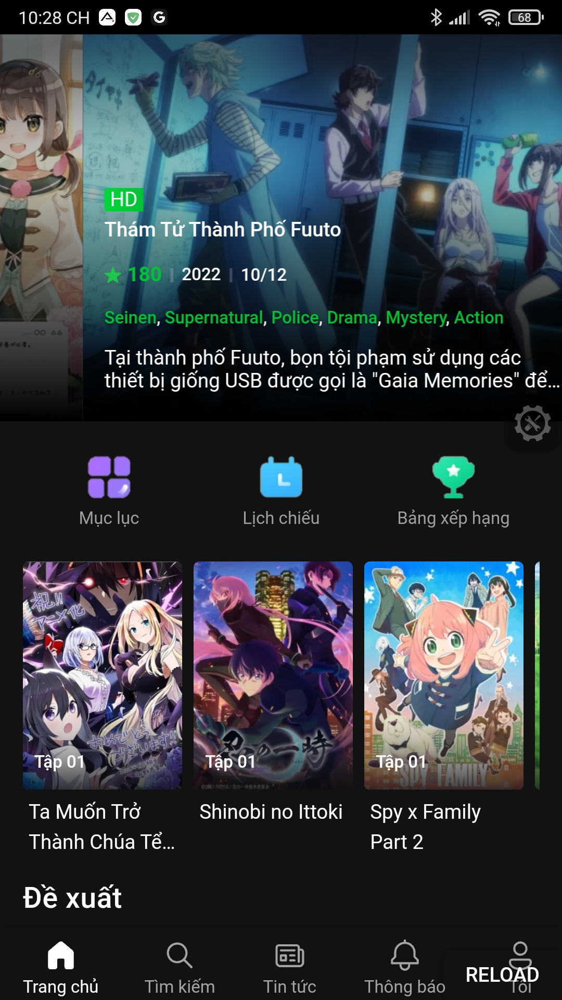
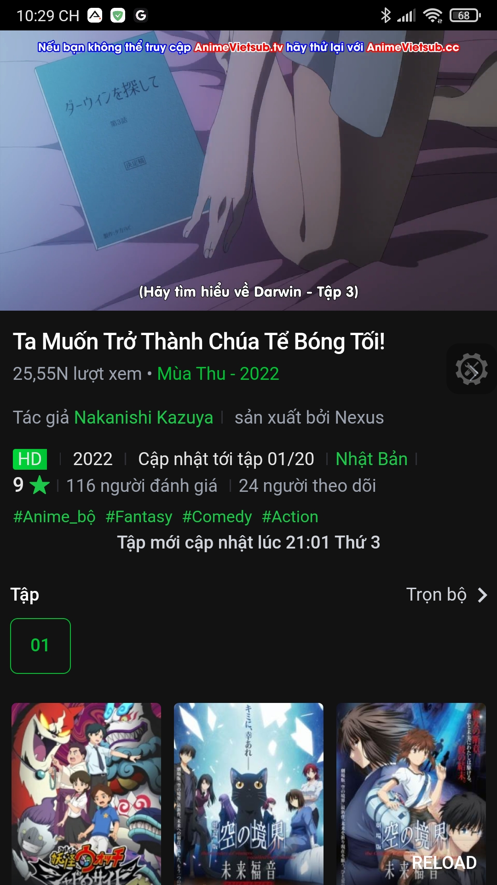
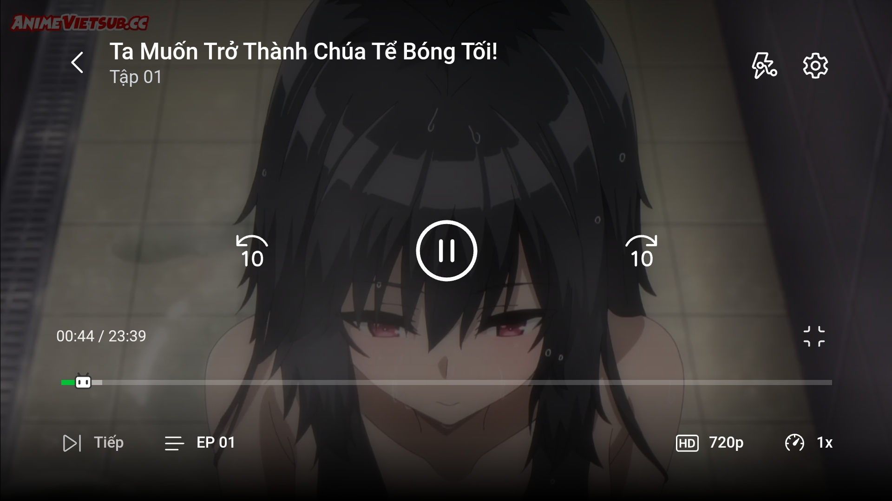
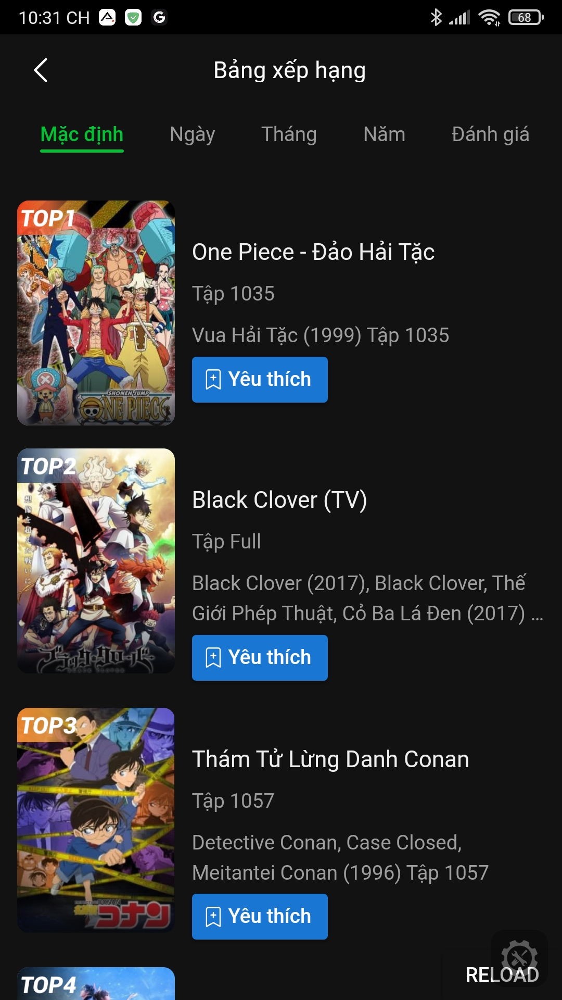
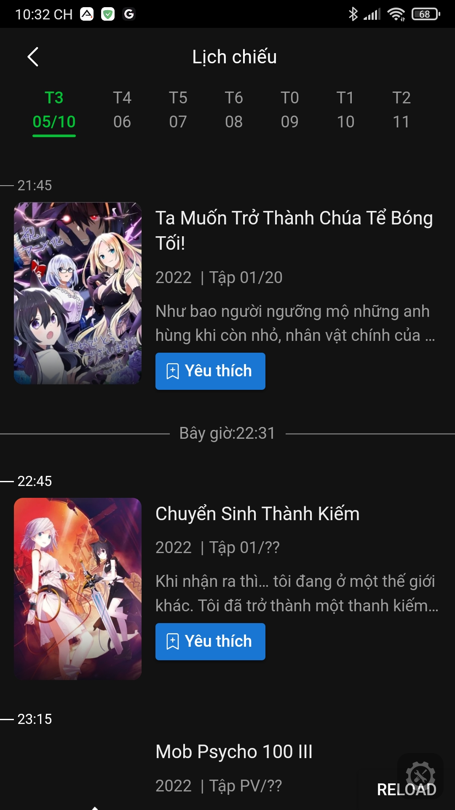
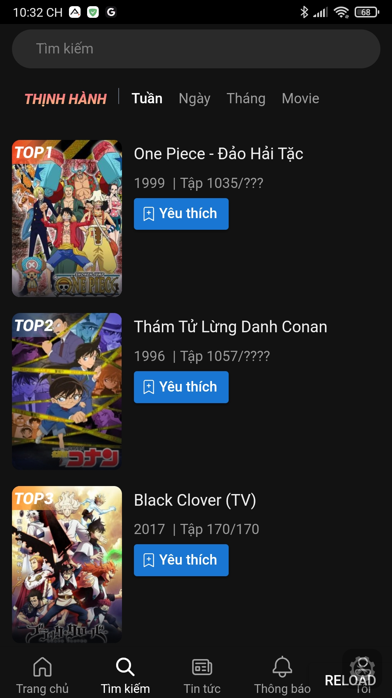
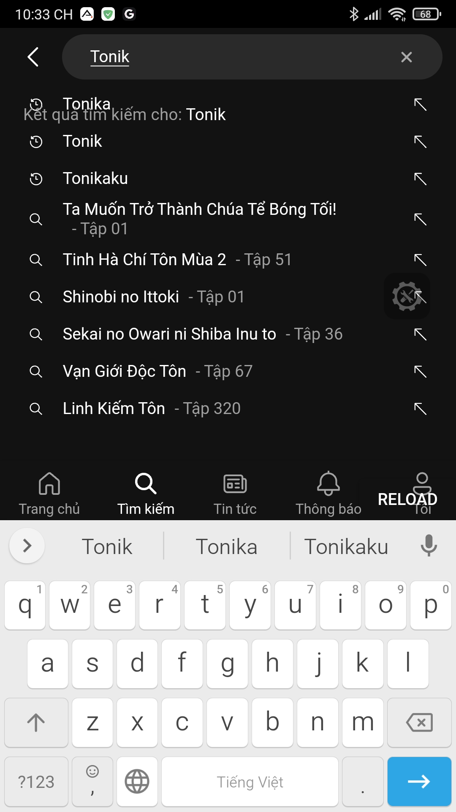
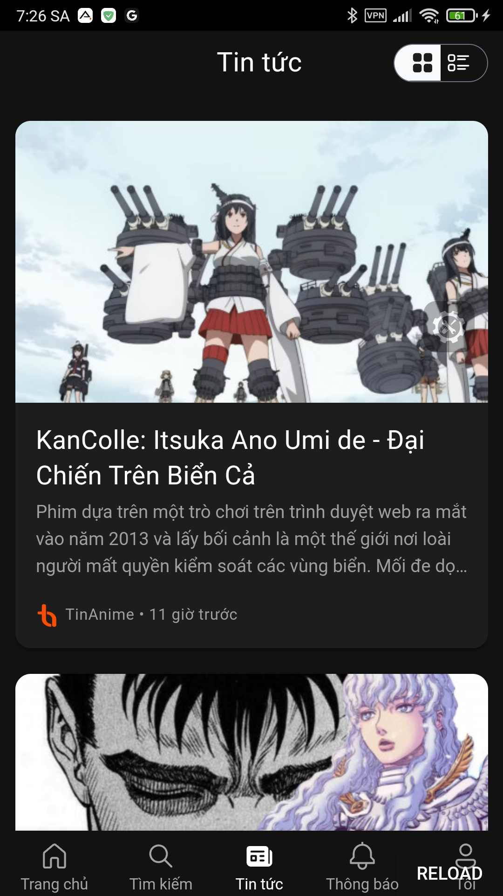
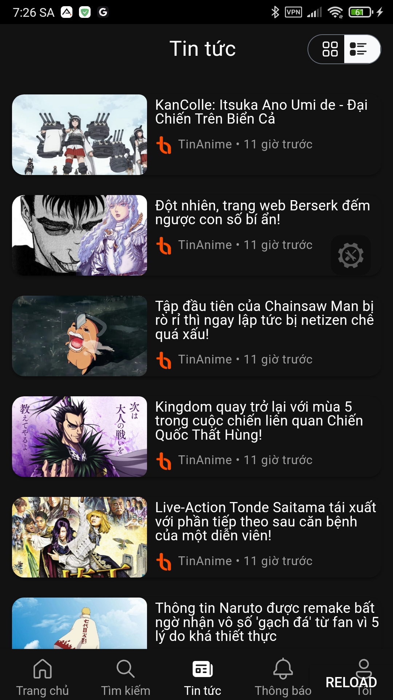

# Informal AnimeVsub Application!

   
   <h1 style="font-size: 16px">AnimeVsub</h1>

> The goal of this application is to allow users to interact intuitively and explore new Anime sets in place of the outdated web interface of [animevsub](https://animevietsub.tv).
>
> And especially this app will **speed up the Anime viewer by 20 times**!! That means no more `downloading...`, enjoy the best quality Anime episodes and no `downloading...`

## Screenshot
<!--screenshot-->

   

<!--/screenshot-->

## Development

### To be on

- [x] API system
- [x] UI
- [x] Tabs option type in Index.vue
- [x] router: bang-xep-hang
- [x] router: search
- [x] router: lich-chieu-phim
- [ ] button follow anime
- [ ] scan QR code to login
- [x] restore progress watch anime
- [x] history and follows
- [ ] tai-khoan/settings/player
- [x] tai-khoan/about
- [x] tai-khoan/history
- [x] tai-khoan/follow
