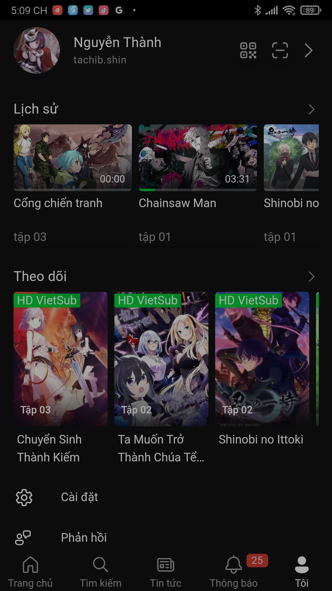
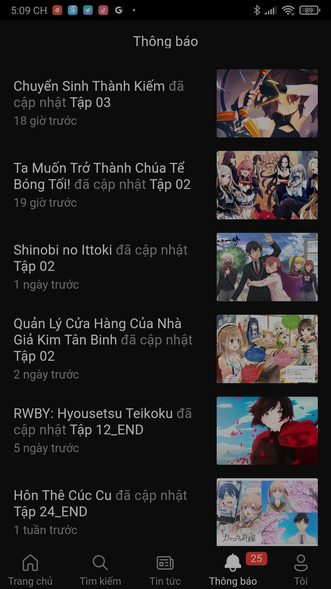

# AnimeVsub Application!

> [!WARNING]
> 📢⚠️📌❗ **The application is currently distributed for free on GitHub and it is OPEN SOURCE COMPLYING WITH THE [GNU GPL-3.0 LICENSE](./LICENSE)
> PLEASE DO NOT MODIFY IT TO EMBEDD ADVERTISING OR USE IT FOR COMMERCIAL PURPOSES.**

> **IF FRAUDULENT BEHAVIORS SUCH AS INSERTING ADS AND TAKEAWAYS OF THE APP CONTINUE I WILL SHUT DOWN THE ENTIRE APP WITH A FOREIGN KEY (ALL MODIFIED APPS WILL ALSO STOP WORKING) AND STOP APP DEVELOPMENT**

   
   <h1 style="font-size: 16px">AnimeVsub</h1>

> [!IMPORTANT]
> **Visit https://app.animevsub.eu.org to download APK**

> [!TIP]
> The current desktop version [open source](https://github.com/anime-vsub/desktop-web) is available at: https://animevsub.eu.org

> ~~The goal of this application is to allow users to interact intuitively and explore new Anime sets in place of the outdated web interface of [animevietsub](https://animevietsub.pro).~~
>
> And especially this app will **speed up the Anime viewer by 20 times**!! That means no more `loading...`, enjoy the best quality Anime episodes and no `loading...`

 <!--  -->

## Download APK for Android

> [!TIP]
> Download app for Android at: https://app.animevsub.eu.org

## Reason for PWA

With Cap4's slowdown in increasingly heavy applications it has proved slower than ever. So we decided to switch it to [Progressive Web Application](https://web.dev/progressive-web-apps/).

However, there was a problem with PWA support that the request cors domain was not accepted. So we resorted to the help of Browser Extensions/Addons [AnimeVsub Helper](https://github.com/anime-vsub/extension-animevsub-helper).

The fact that `Chrome Android` and `Edge Android` do not support extensions like its desktop versions causes many problems that you cannot use this application with only the default browsers on your phone. I consider this a step backwards for both `Chrome` and `Edge` from fully supported extensions/addons like `Firefox`, `Flow` and `Yandex`.

## Use a modern browser that supports extensions

As I mentioned above this application needs extensions and it requires a really modern browser. I recommend you to use one of the following browsers:

|  |  |  |  |  |  |
| --------------------------------------------------------------------------------------------------------------------------- | ------------------------------------------------------------------------------------------- | --------------------------------------------------------------------------------------------------------------------------- | ---------------------------------------------------------------------------------------------------------------------------- | -------------------------------------------------------------------------------------------------------------------- | --------------------------------------------------------------------------------------------------------------------------- |
| [Lemur Browser](https://lemurbrowser.com/)                                                                                  | [Kiwi Browser](https://kiwibrowser.com/)                                                    | [Firefox Browser](https://www.mozilla.org/vi/firefox/browsers/mobile/)                                                      | [Flow Browser](https://play.google.com/store/apps/details?id=org.flow.browser&hl=en_US)                                      | [Mises Browser](https://www.mises.site/)                                                                             | [Yandex Browser](https://browser.yandex.com/beta/)                                                                          |

After installing the browser install the utility [AnimeVsub Helper](https://github.com/anime-vsub/extension-animevsub-helper) and go to https://m.animevsub.eu.org

Wait for a while you will see the browser wants to install `AnimeVsub` and you can exit the browser then open `AnimeVsub` in the main screen.

## Sponsor ☕

If you find this project useful please support me through:
|  |  |
| :------------------: | :--------------------: |
| [Momo](https://me.momo.vn/tachibshin) | [Timo or Bank](https://anime-vsub.github.io/about/sponsors) |

## Screenshot

<!--screenshot-->

   

<!--/screenshot-->

## Development

### To be on

- [x] API system
- [x] UI
- [x] Tabs option type in Index.vue
- [x] router: bang-xep-hang
- [x] router: search
- [x] router: lich-chieu-phim
- [ ] button follow anime
- [ ] scan QR code to login
- [x] restore progress watch anime
- [x] history and follows
- [x] tai-khoan/settings/player
- [x] tai-khoan/about
- [x] tai-khoan/history
- [x] tai-khoan/follow
- [x] pull to refresh
