# AnimeVsub Application!

> [!WARNING]
> 📢⚠️📌❗ **The application is currently distributed for free on GitHub and it is OPEN SOURCE COMPLYING WITH THE [GNU GPL-3.0 LICENSE](./LICENSE)**
> **PLEASE DO NOT MODIFY IT TO EMBEDD ADVERTISING OR USE IT FOR COMMERCIAL PURPOSES.**
>
> **IF FRAUDULENT BEHAVIORS SUCH AS INSERTING ADS AND TAKEAWAYS OF THE APP CONTINUE I WILL SHUT DOWN THE ENTIRE APP WITH A FOREIGN KEY (ALL MODIFIED APPS WILL ALSO STOP WORKING) AND STOP APP DEVELOPMENT**

   
   <h1 style="font-size: 16px">AnimeVsub</h1>

> [!IMPORTANT] 
> **Visit https://app.animevsub.eu.org to download APK**

> [!TIP]
> The current desktop version [open source](https://github.com/anime-vsub/desktop-web) is available at: https://animevsub.eu.org

> The goal of this application is to allow users to interact intuitively and explore new Anime sets in place of the outdated web interface of [animevietsub](https://animevietsub.pro).
>
> And especially this app will **speed up the Anime viewer by 20 times**!! That means no more `loading...`, enjoy the best quality Anime episodes and no `loading...`
>
> Source legacy app at [branch legacy](https://github.com/anime-vsub/app/blob/legacy)

## Download APK for Android

> [!TIP]
> Download app for Android at: https://app.animevsub.eu.org

## Sponsor ☕

If you find this project useful please support me through:

|  |  |
|:---------------------------------------------------------------------------------------------------------------------------------------------------------------:|:-----------------------------------------------------------------------------------------------------------------------------------------------------------------------------:|
|                                                              [Momo](https://me.momo.vn/tachibshin)                                                              |                                                          [Timo or Bank](https://anime-vsub.github.io/about/sponsors)                                                          |

## Screenshot

<!--screenshot-->

   <a href="./meta/screenshoots/Screenshot_2022-10-05-22-28-37-000_git.shin.animevsub.jpg">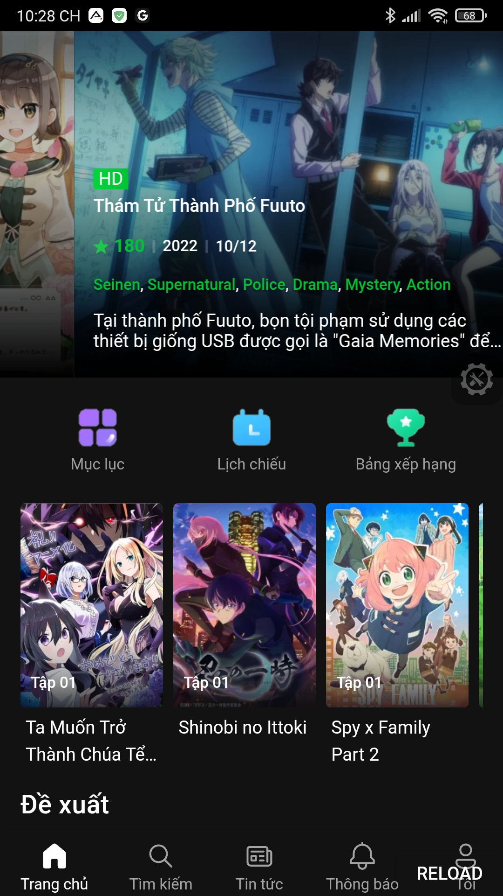</a>
<a href="./meta/screenshoots/Screenshot_2022-10-05-22-29-39-832_git.shin.animevsub.jpg">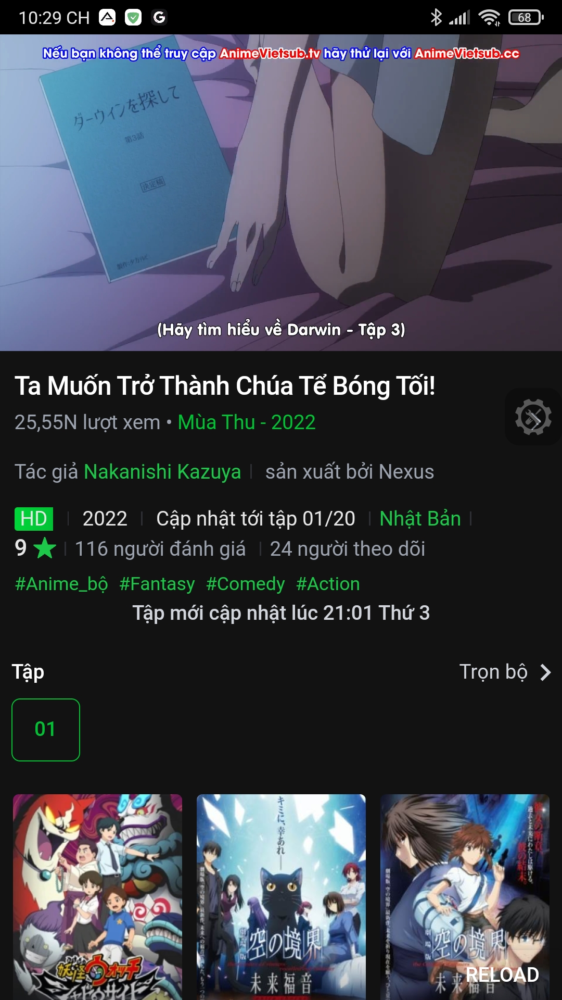</a>
<a href="./meta/screenshoots/Screenshot_2022-10-05-22-29-57-310_git.shin.animevsub.jpg">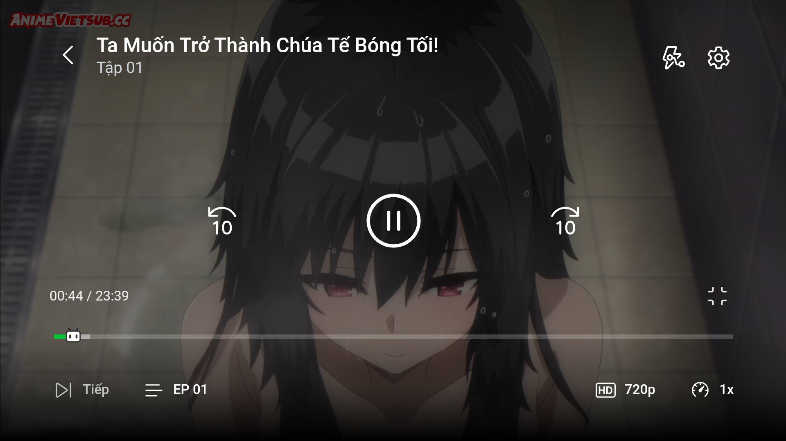</a>
<a href="./meta/screenshoots/Screenshot_2022-10-05-22-31-48-569_git.shin.animevsub.jpg">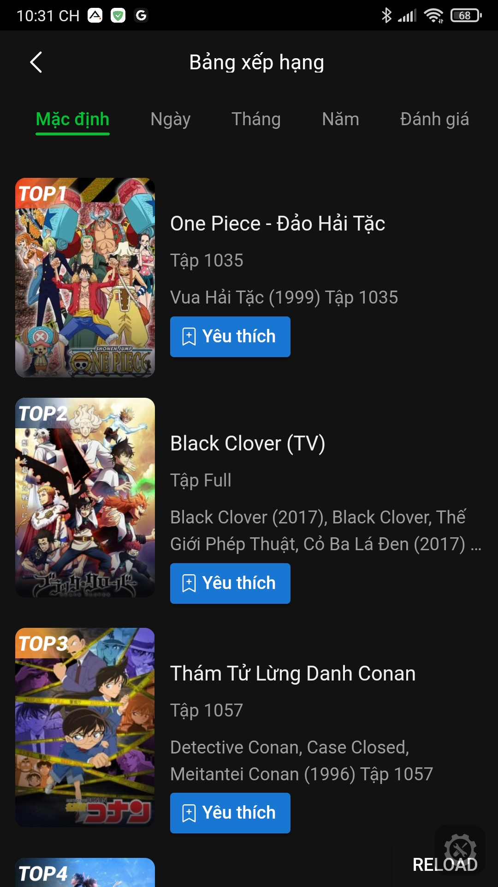</a>
<a href="./meta/screenshoots/Screenshot_2022-10-05-22-32-00-161_git.shin.animevsub.jpg">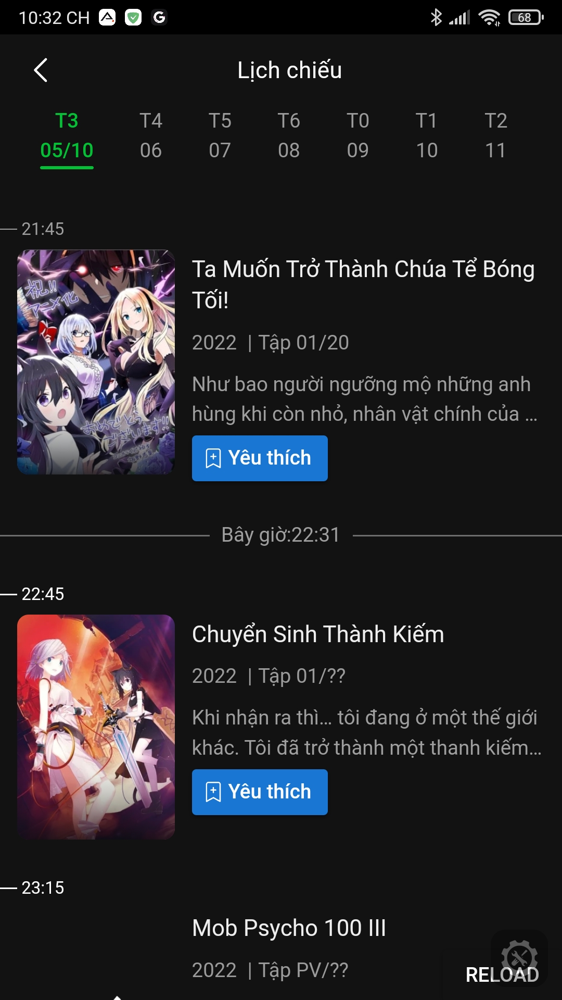</a>
<a href="./meta/screenshoots/Screenshot_2022-10-05-22-32-11-722_git.shin.animevsub.jpg">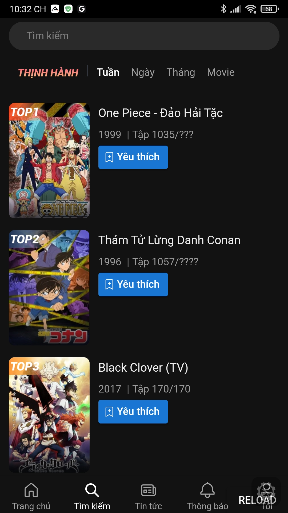</a>
<a href="./meta/screenshoots/Screenshot_2022-10-05-22-33-12-869_git.shin.animevsub.jpg">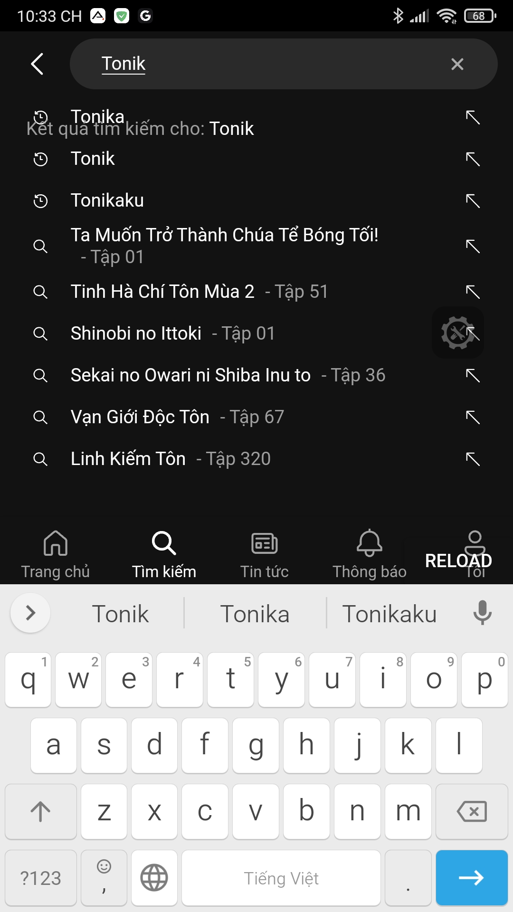</a>
<a href="./meta/screenshoots/Screenshot_2022-10-06-07-26-11-027_git.shin.animevsub.jpg">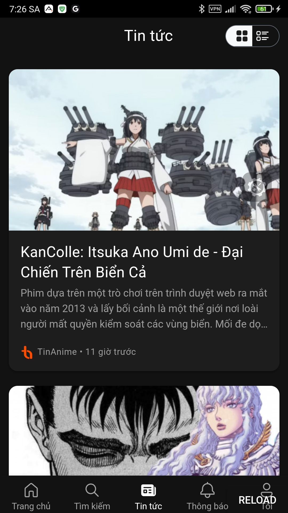</a>
<a href="./meta/screenshoots/Screenshot_2022-10-06-07-26-15-284_git.shin.animevsub.jpg">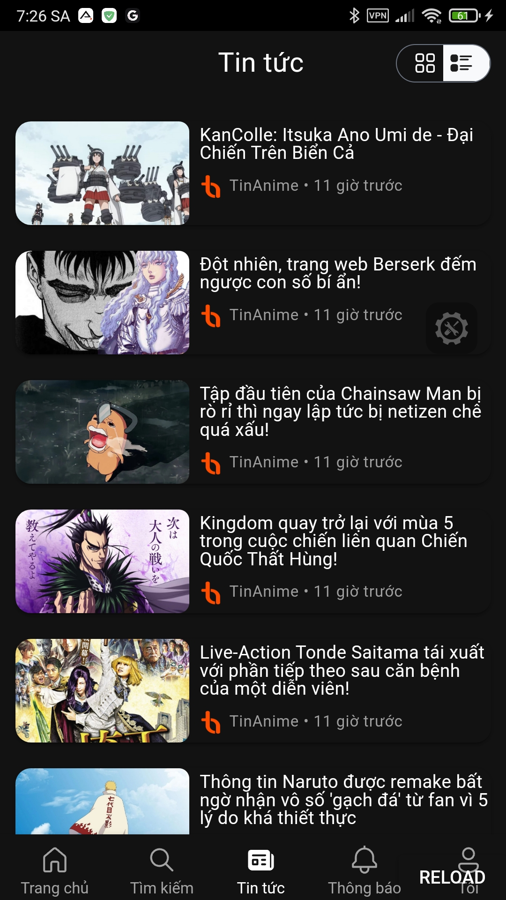</a>
<a href="./meta/screenshoots/Screenshot_2022-10-13-17-09-06-063_git.shin.animevsub.jpg">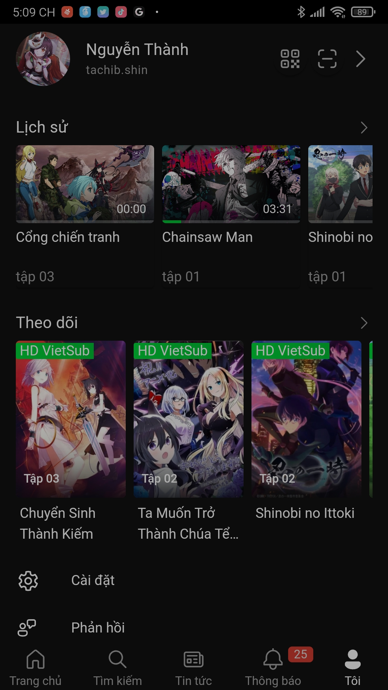</a>
<a href="./meta/screenshoots/Screenshot_2022-10-13-17-09-13-504_git.shin.animevsub.jpg">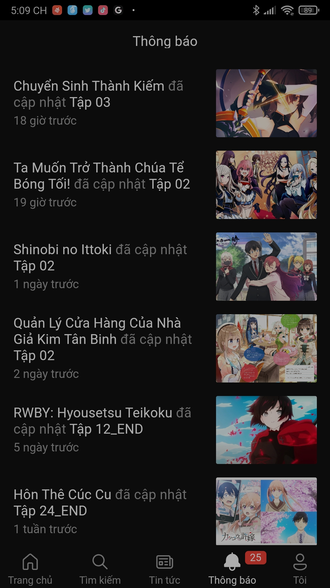</a>

<!--/screenshot-->

### To be on

- [x] API system
- [x] UI
- [x] Tabs option type in Index.vue
- [x] router: bang-xep-hang
- [x] router: search
- [x] router: lich-chieu-phim
- [ ] button follow anime
- [ ] scan QR code to login
- [x] restore progress watch anime
- [x] history and follows
- [x] tai-khoan/settings/player
- [x] tai-khoan/about
- [x] tai-khoan/history
- [x] tai-khoan/follow
- [x] pull to refresh

## Copyright

(c) 2022 - now by Tachibana Shin with GNU GPL v3
